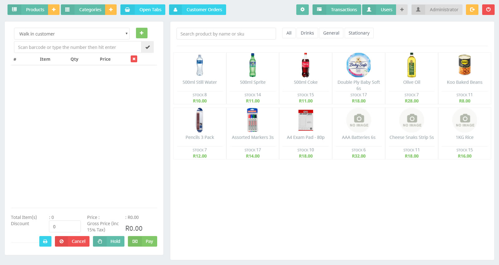
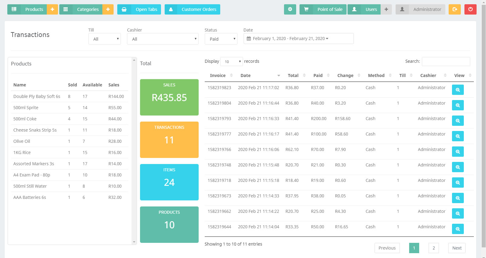
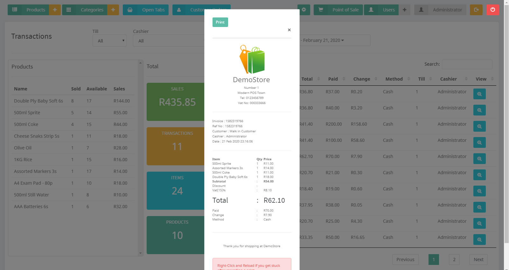
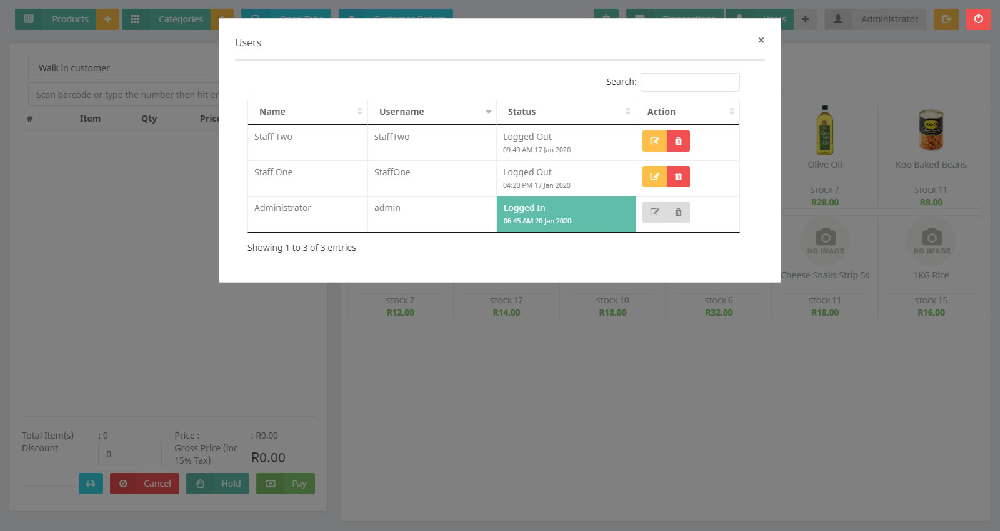

# MetroPOS

<p align="center">
  
</p>

[](https://github.com/Mephisto-Von/Hardware-Point-of-Sale/releases/latest)
[](https://github.com/Mephisto-Von/Hardware-Point-of-Sale/releases/latest)
[](LICENSE)

A full-featured Point of Sale (POS) desktop application designed for hardware and retail stores.  
Built with **Electron** and **Node.js** — works as a standalone desktop app or as a web app in any browser.

---

## Table of Contents

- [Screenshots](#screenshots)
- [Download & Install](#download--install)
- [Quick Start](#quick-start)
- [Features](#features)
- [How to Use](#how-to-use)
- [Multi-User Network Setup](#multi-user-network-setup)
- [Build from Source](#build-from-source)
- [Project Structure](#project-structure)
- [Tech Stack](#tech-stack)
- [FAQ](#faq)

---

## Screenshots

| Point of Sale | Transactions |
|---|---|
|  |  |

| Receipt Print | User Management |
|---|---|
|  |  |

---

## Download & Install

### 🪟 Windows (Desktop App)

| File | Description | Link |
|------|-------------|------|
| **Setup.exe** | Full installer — creates shortcuts, adds to Start Menu | [Download](https://github.com/Mephisto-Von/Hardware-Point-of-Sale/releases/latest/download/MetroPOS.Setup.0.3.0.exe) |
| **Portable.exe** | No installation needed — run from USB or any folder | [Download](https://github.com/Mephisto-Von/Hardware-Point-of-Sale/releases/latest/download/MetroPOS.0.3.0.exe) |

**To install:**  
1. Download **Setup.exe**  
2. Run the installer and follow the prompts  
3. Launch **MetroPOS** from the Start Menu or desktop shortcut  

### 🌐 Web App (Any OS — no install)

Run in any browser on Windows, macOS, or Linux:

```bash
# 1. Install Node.js (https://nodejs.org)
# 2. Download or clone this repository
git clone https://github.com/Mephisto-Von/Hardware-Point-of-Sale.git
cd MetroPOS

# 3. Install dependencies
npm install

# 4. Start the server
node server.js
```

Open **http://localhost:8001** in your browser.

> **Default login:** username: `admin`, password: `admin`

---

## Quick Start

### First-Time Setup

1. **Start the app** (either launch the desktop app or run `node server.js` for web mode)
2. **Log in** with `admin` / `admin`
3. **Add your products** — click **Products > +** to add items with barcodes, prices, and stock
4. **Add categories** — click **Categories > +** to organize your products
5. **Configure your store** — click the **gear icon (⚙)** to set your store name, currency, tax rate, and logo
6. **Start selling** — switch to **Point of Sale** mode and begin ringing up customers

### Selling an Item

1. Click **Point of Sale** in the top-right
2. Select a **customer** (optional) or leave it as "Walk-in"
3. **Search** for a product by name or **scan** a barcode
4. Adjust the **quantity** if needed
5. Click **Pay** to complete the sale
6. Choose payment method: **Cash** or **Card**
7. The receipt will print automatically (if a printer is configured)

---

## Features

### 🛒 Point of Sale
- Barcode scanning via USB scanner or manual entry
- Product search by name or SKU
- Customer selection and management
- Hold orders (save an incomplete order for later)
- Discount per transaction
- Tax calculation (VAT configurable)
- Multiple payment methods (Cash / Card)
- Receipt printing (thermal 80mm or A4 invoice)

### 📦 Inventory Management
- Add, edit, and delete products
- Barcode generation (Code128)
- Stock tracking with low-stock alerts
- Units of measure: Pieces, Meters, Kg, Liters
- Product images
- Disable stock check for non-inventory items

### 👥 User Management
- Role-based permissions per user
- Actions tracked per cashier
- Permissions control: Products, Categories, Transactions, Users, Settings

### 📊 Transaction History
- Filter by date range
- Filter by cashier, till, or payment status (Paid/Unpaid)
- View sales totals and item counts
- Detailed product sales breakdown

### 🏪 Store Settings
- Store name, address, and contact info
- Currency symbol
- VAT percentage and toggle
- Receipt footer message
- Store logo
- Network mode: Standalone, Terminal, or Server

---

## How to Use

### Managing Products

1. Click **Products** button in the toolbar
2. Click **+** to add a new product
3. Fill in: Name, Category, Price, Stock quantity, Unit of Measure
4. Optionally upload an image and toggle stock tracking off
5. Click **Submit** to save

### Managing Users

1. Click **Users** button in the toolbar
2. Click **+** to add a new user
3. Set: Full Name, Username, Password
4. Check the **permissions** you want to grant:
   - *Manage Products and Stock*
   - *Manage Product Categories*
   - *View Transactions*
   - *Manage Users and Permissions*
   - *Manage Settings*
5. Click **Submit**

### Viewing Reports

1. Click **Transactions** in the toolbar
2. Use the filters at the top:
   - **Till** — filter by register
   - **Cashier** — filter by employee
   - **Status** — Paid or Unpaid
   - **Date Range** — pick any date period
3. The dashboard shows:
   - Total sales amount
   - Number of transactions
   - Items sold count
   - Products in inventory
   - Per-product sales breakdown

---

## Multi-User Network Setup

The POS can run across multiple computers sharing one database.

### Option 1: Standalone (Default)
Everything runs on a single machine. Best for single-register stores.

### Option 2: Server + Terminals

**Server PC (admin):**
1. Set the app mode to **Network Point of Sale Server** in Settings
2. Note the IP address shown
3. This machine hosts the shared database

**Terminal PCs (cashiers):**
1. Set the app mode to **Network Point of Sale Terminal** in Settings
2. Enter the **Server IP Address** and assign a **Till Number**
3. All transactions are saved to the central server database

> Tip: Use a static IP for the server machine.

---

## Build from Source

### Prerequisites

- [Node.js](https://nodejs.org/) (v16 or later)
- npm (ships with Node.js)

### Build Windows Installer

```bash
# Install dependencies
npm install

# Build NSIS installer (.exe)
npm run electron-build -- --win

# Build portable .exe (single-file, no installer)
npm run electron-build -- --win --config.win.target=portable

# Build MSI (Windows only — requires WiX toolchain)
npm run electron-build -- --win --config.win.target=msi
```

Output is placed in the `release/` directory.

### Run in Development Mode

```bash
# Web mode (browser)
node server.js

# Desktop mode (requires display)
npm run electron
```

---

## Project Structure

```
MetroPOS/
├── server.js              Express API server (port 8001)
├── start.js               Electron main process
├── index.html             Frontend UI layout
├── renderer.js            Renderer process entry
├── package.json           Dependencies and build scripts
├── build.js               Build helper
│
├── api/                   REST API endpoints
│   ├── inventory.js       Product and stock management
│   ├── customers.js       Customer database
│   ├── categories.js      Product categories
│   ├── transactions.js    Sales and order management
│   ├── settings.js        Store configuration
│   └── users.js           User accounts and auth
│
├── assets/                Frontend assets
│   ├── css/               Stylesheets (Bootstrap, icons, custom)
│   ├── fonts/             Icon fonts
│   ├── images/            App icons, logos, sprites
│   ├── js/                Client-side JavaScript
│   │   ├── pos.js         Main POS application logic
│   │   └── product-filter.js  Product filtering/search
│   └── plugins/           3rd-party libraries
│
├── installers/            Squirrel installer events
│   └── setupEvents.js     Windows install/uninstall hooks
│
├── public/                PWA manifest and web assets
├── screenshots/           App screenshots
├── data/                  Local data (auto-created)
│   ├── uploads/           Uploaded product images
│   └── server/databases/  nedb database files
└── release/               Build output (git-ignored)
```

---

## Tech Stack

| Layer | Technology |
|-------|-----------|
| **Desktop Shell** | Electron 22 |
| **Backend** | Node.js + Express |
| **Database** | @seald-io/nedb (embedded, zero-config) |
| **Frontend** | jQuery, Bootstrap 3 |
| **Printing** | print-js, jsPDF |
| **Barcodes** | JsBarcode |
| **Charts** | DataTables |
| **Packaging** | electron-builder, NSIS |
| **Auth** | JWT + bcrypt |
| **Security** | DOMPurify (XSS prevention) |

---

## FAQ

**Q: Can I use this without an internet connection?**  
A: Yes. The app runs entirely locally — no internet required.

**Q: Does it work with any barcode scanner?**  
A: Yes. Most USB barcode scanners emulate a keyboard. Just scan and the code appears in the search field.

**Q: Where is my data stored?**  
A: In the `data/` folder (inside the project directory or alongside the .exe). Database files use the nedb format.

**Q: Can I use it on a tablet?**  
A: Yes. Run `node server.js` and access the web interface from any device on the same network.

**Q: How do I reset the admin password?**  
A: Delete the `users.db` file in `data/server/databases/` and restart. The default admin account will be recreated.

---

*Built with ❤️ for hardware stores everywhere.*
